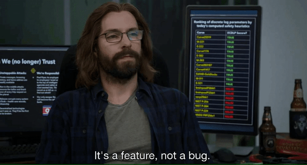

<li>🔭Hazırda <strong>Python öyrənməyə çalışıram</strong></li>
<li>🌱 Python da <strong>Telegram</strong> botları yaradıram.</li>
<li>💬 Məndən <strong> Telegram və Python </strong> barədə soruşun.</li>
<li>👨‍💻 <strong> Layihələrimin </strong> əksəriyyəti <a href="https://t.me/Sxamil"><strong>BLOG</strong></a> kanalımda'da mövcuddur </li> 
<li>🦹 Sevimli super <strong>heyvanım</strong> 
<li>⚡ Boş vaxtlarımda gəzməyi sevirəm</li>
</ul>
<h2>🚀 İstifadə etdiyim bəzi alətlər</h2>

